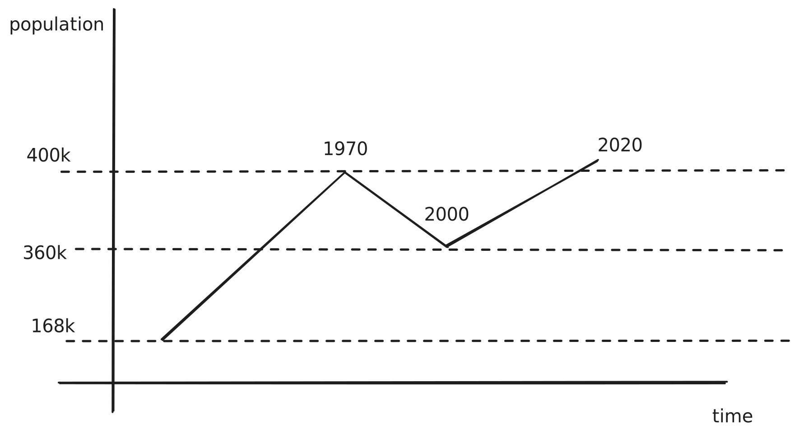

# 2025-11-05 - Verdichtung

Verdichtung is German word that loosely means "densification". It represents an alternative to urban sprawl that is prevalent in US citizies and has been the dominant strategy for Zurich's expansion.

What it means is that even though there would theoretically new space available on the outskirts, the city, or canton instead, instead of dedicating it to new construction prefers to repurpose existing buildings by increasing the number of floors or by reducing the (often useless) distance between buildings.

I am actually currently living in such a building created from Verdichtung where before this was partially a parking lot and partially an annex of another building. Looking at historical maps, there are many such occurences but maps only tell half the story as they often look directly from above, the Verdichtung also often means an increase in height. This does create more living space overall but it also creates some weird apartments that feel way too close together and that often can only serve people that ~~do not~~ are unable to have any demands for either sunlight, privacy, or quietness. For example, a parking lot not far away was repurposed into a hotel=like complex where balconies made out of pure concrete are facing each other.

 

<em>A Google Earth images of Schlieren from 2009 and 2024 showing the practicalities of verdichtung</em>.

## Zurich's ups and downs

Zurich has a weird history when it comes to it's urban population where its population peeked in the 1970s and only recently reached the same level again. This is pretty different from many other urban centers as urbanization has been rampant in europe in the last decades and has been influenced by various factors like the different tax rates across the canton.

 
<em>The population of ZRH over time, rough estimate, source: Federal Statistical Office of Switzerland.</em>

## Is Verdichtung a good thing?

Short-term, this seems like much less nice than living in a suburban area but long-term this is much more sustainable. Has it been able to meet demands? No. Zurich's rental market is one of the worst in the world or maybe even the worst according to recent studies on real estate bubbles by UBS market research. Are there many alternatives? No. Not really as free areas are sparse and the city is sandwiched between the lake and an airport that is just 10 km away from the city. 

Prices go down steeply the further you move from the gold coast and lakes.

